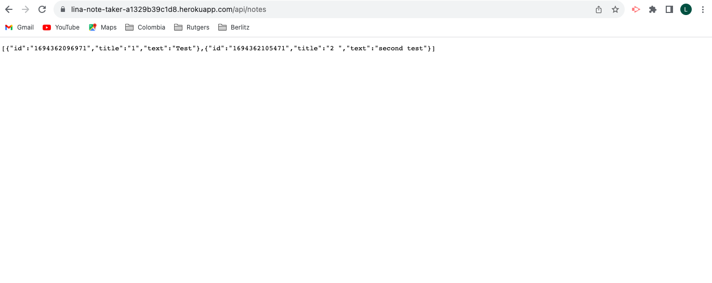

# Note_Taker

## Description

This project was created to write and save notes using an Express.js back end.

The application save and retrieve note data from a JSON file.

## Table of Contents
- [Description](#description)
- [Table of Contents](#table-of-contents)
- [Installation](#installation)
- [Usage](#usage)
- [License](#license)
- [Note](#note)

## Installation

N/A

## Usage

The URL of the functional, deployed application (Heroku) is https://lina-note-taker-a1329b39c1d8.herokuapp.com/notes

Application for taking personal notes. The functionality includes adding, updating and deleting notes. 

## License

## Note

This project was created based on reviewing activities from the previous classes at bootcamp and Google searches.

